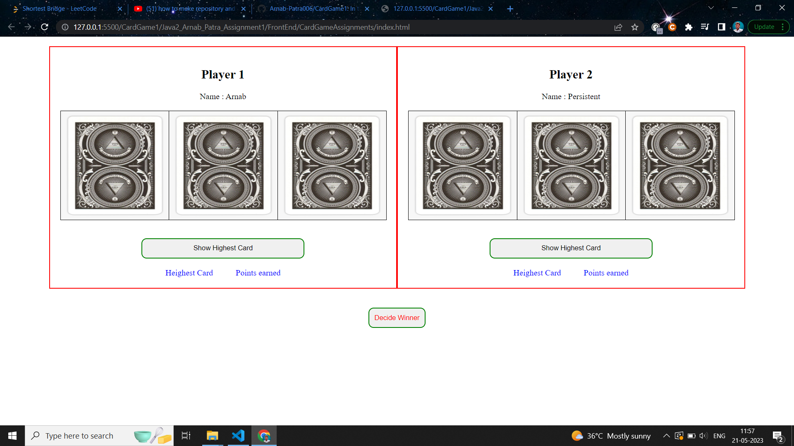
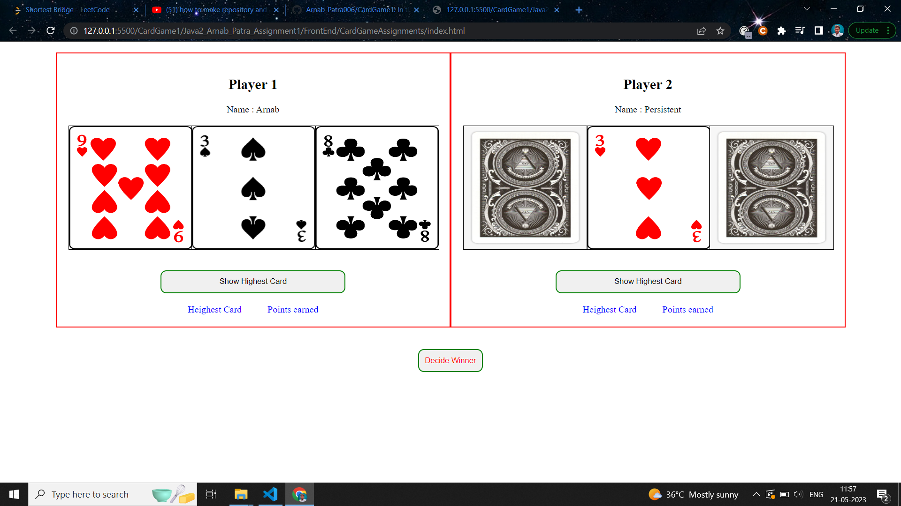
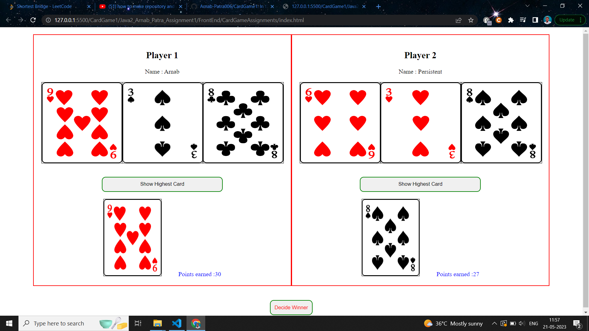
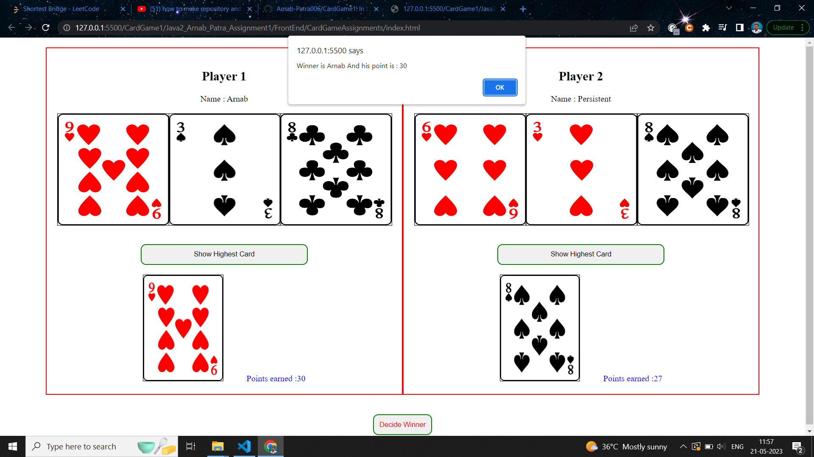

# Flip The Ace
In this project i have used HTML,CSS,JS as FrontEnd and JAVA as BackEnd and connected them through JSON file.

The Game InterFace Looks Like this :
SS 1 : About to start the Game ...Players getting ready...Two players are given random shuffeled cards showing their back i.e. no one have a idea who's gonna win.

SS 2: First Player started flipping his/her cards and flipped all...

SS 3: Second Player started flipping ...

SS 4: After comparing show highest card of each of the players we are determining the winner along with their score.

